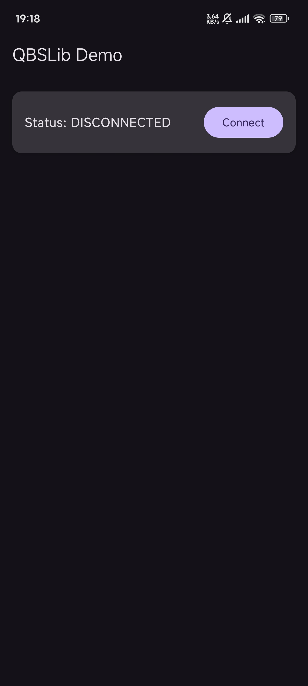
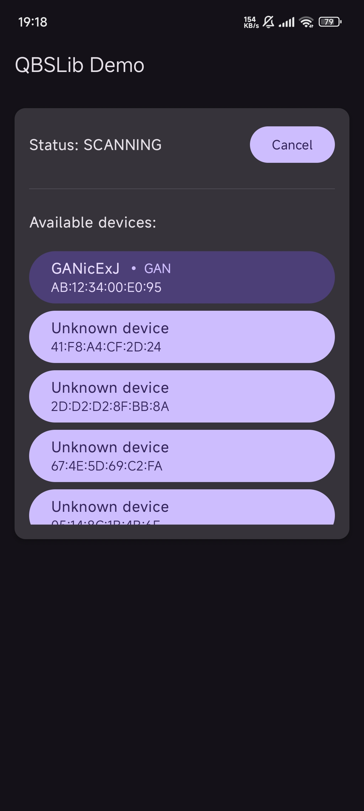
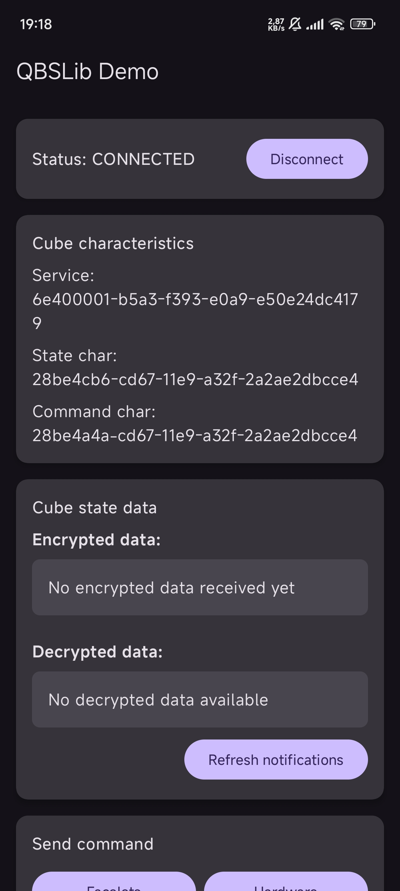
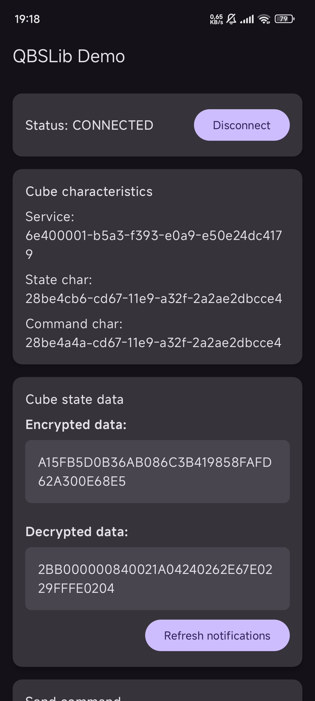
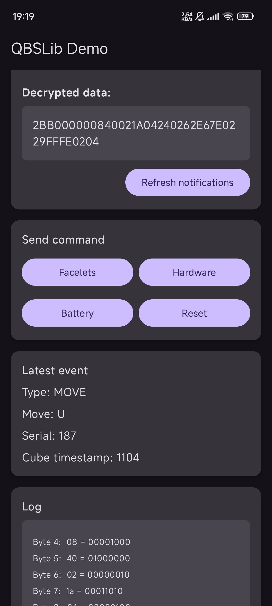
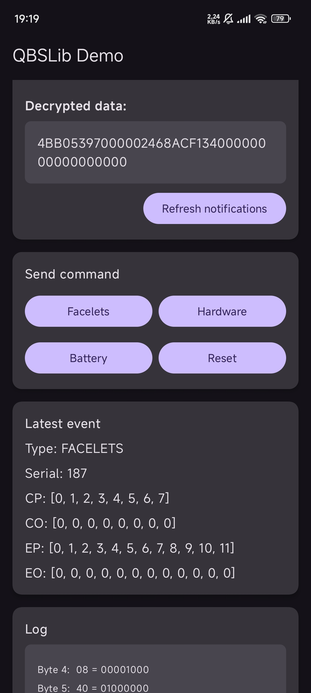
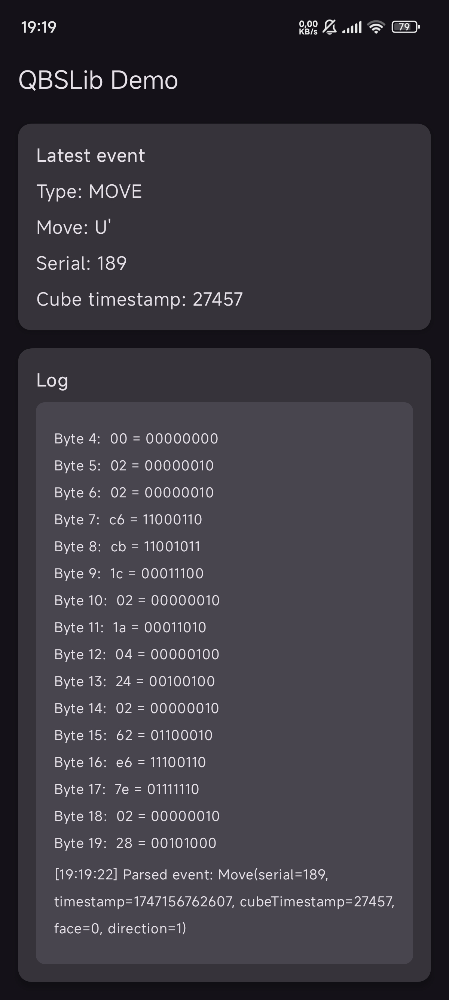

# 💻 QBSLib Demo


Tato aplikace byla vytvořena v rámci bakalářského projektu na [Technické univerzitě v Liberci](https://www.tul.cz/) během letního semestru v akademickém roce 2024/2025. Slouží jako demonstrace úspěšného zdokumentování protokolu GAN Gen2 Protocol, kterým komunikují chytré Bluetooth kostky výrobce [GAN](https://www.gancube.com/) se zařízeními s podporou pro technologii BLE.

## 📱 Technologie

- 🔷 [Kotlin](https://kotlinlang.org/) - moderní programovací jazyk pro Android
- 🖌️ [Jetpack Compose](https://developer.android.com/jetpack/compose) - moderní toolkit pro nativní UI
- 🛠️ Vývoj v [Android Studio](https://developer.android.com/studio)
- 📱 Cíleno na Android API 31 (Android 12) a vyšší

## ✨ Funkce

- 🔍 Vyhledávání okolních zařízení a připojení ke kostce GAN přes Bluetooth
- 📊 Zobrazení dat z kostky v reálném čase
- 📈 Logování všech přenesených bytů v rozšifrované podobě
- ⚙️ Posílání příkazů

## 🚀 Instalace

1. Stáhněte si nejnovější APK z [releases](https://github.com/Matej-Zucha-TUL/qbslib-demo/releases/download/Prerelease/QBSLib_Demo_v1.0_release.apk)
2. Povolte instalaci z neznámých zdrojů v nastavení vašeho zařízení
3. Nainstalujte aplikaci

*nebo*

Zkompilujte projekt pomocí Android Studia:
```bash
git clone https://github.com/tve-uzivatelske-jmeno/qbslib-demo.git
cd qbslib-demo
./gradlew assembleDebug
```

## 📸 Ukázky

### Připojení a vyhledávání zařízení
<p float="left">
  
  
</p>

### Informace o kostce
<p float="left">
  
  
</p>
<p float="left">
  
  
</p>

### Protokolové logy


## 💡 Inspirace

Tato aplikace za svou existenci vděčí repozitáři [gan-web-bluetooth](https://github.com/afedotov/gan-web-bluetooth) od vývojáře [@afedotov](https://github.com/afedotov), bez znalostí o šifrování a protokolech ze zdrojových kódů od něj bych projekt pravděpodobně nedokončil.

## 🙏 Poděkování

Děkuji svému vedoucímu práce Ing. Igoru Kopetschkeovi za cenné rady a veškerou pomoc při tvoření této práce.

## 📜 Licence

Tento projekt spadá pod licenci [GNU GPL 3.0](https://www.gnu.org/licenses/gpl-3.0.en.html) nebo novější.

